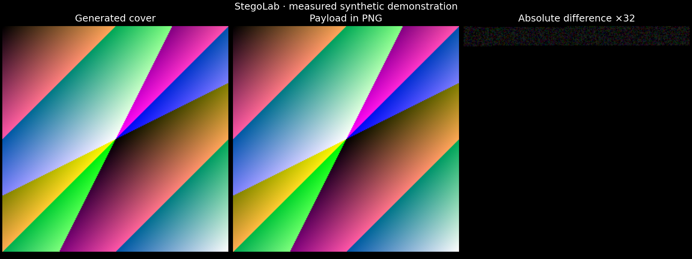
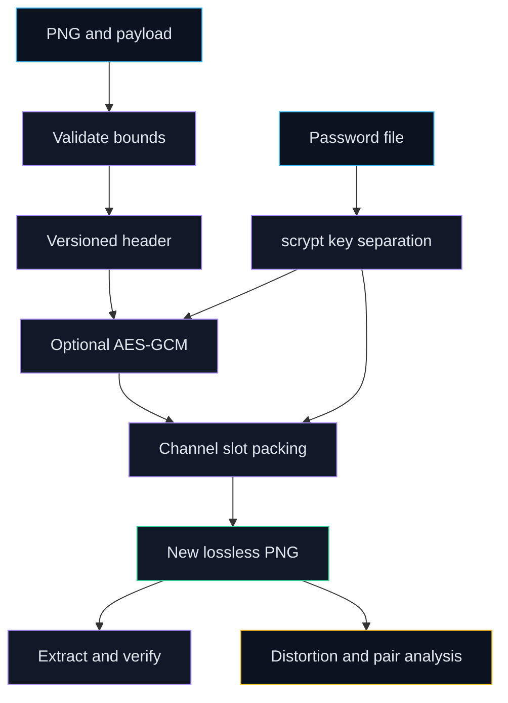
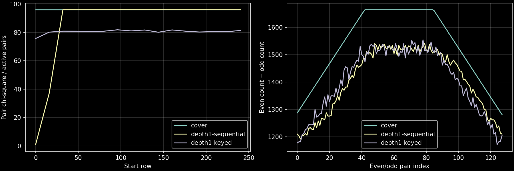

# StegoLab

Embed binary payloads in lossless PNGs, extract independently, and measure distortion and exploratory detection statistics.

[](https://github.com/Prajwal-Pratap-Yadav/Image-Steganography-in-Python/actions/workflows/ci.yml)
[](LICENSE)
[](pyproject.toml)
[](CHANGELOG.md)



Generated by [scripts/reproduce.py](scripts/reproduce.py) from an actual PNG round trip. This synthetic illustration
does not establish concealment on photographs.

## Why this matters

- **Problem:** an image hiding demo needs on-disk framing, capacity checks and honest protection claims.
- **Approach:** explicit lossless framing, optional library encryption, keyed channel ordering and measured statistics.
- **Outcome:** independently extracting CLI commands, reproducible experiments and clear failure boundaries.

## Quickstart

Linux or macOS, Python 3.11+, Git and Make. Setup downloads hash-locked runtime packages and installs the CLI.

```sh
git clone https://github.com/Prajwal-Pratap-Yadav/Image-Steganography-in-Python.git && cd Image-Steganography-in-Python
make setup
make run
```

The demo generates its cover and performs encryption, embedding, extraction and analysis in separate processes.
Outputs go to ignored `reports/local/demo/`. See [usage](docs/usage.md) for your own files.
No package is published to PyPI. Network speed affects installation time.

## Features

- Binary framing; RGB/RGBA PNG with unchanged alpha; capacity, embed, extract and analyze commands.
- Lossless-only input, bounded reads/dimensions/pixels/payload/password, new-file-only output and stripped metadata.
- Optional AES-256-GCM with scrypt and separately keyed pseudo-random channel ordering.
- Plain SHA-256 corruption checks; HMAC for keyed plaintext; header authentication when encrypted.
- PSNR, SSIM, histograms and exploratory even/odd pair analysis with defined edge cases.

## Architecture



The visible fixed header frames the following payload channels; alpha is excluded. Encryption authenticates the header
as associated data. Extraction validates bounds before key derivation and writes after verification.
See [architecture](docs/architecture.md).

## Design decisions

| Decision | Alternatives considered | Why | Trade-off |
|---|---|---|---|
| [PNG only](docs/adr/0001-lossless-format.md) | JPEG, automatic conversion | Bits survive a lossless save | Recompression/resizing destroys payloads |
| [Visible header](docs/adr/0001-lossless-format.md) | Terminators, guessed lengths | Independent binary extraction | Recognizable signature and overhead |
| [Library AEAD and separate keys](docs/adr/0002-key-separation.md) | Password comparison, shared key | Authentication, distinct purposes | Guessing and KDF cost remain |

## Results and limitations

✅ **Measured synthetic experiment:** generated cover, public random payload, sequential and keyed plaintext.
Each case uses a generated 256 × 256 RGB image and 2,048 payload bytes. Capacity reports the maximum available space.
Source [f751b2a](https://github.com/Prajwal-Pratap-Yadav/Image-Steganography-in-Python/commit/f751b2ac65143582f2eed2009a4b0990311af08a);
command `make reproduce`; exact values and environment: [CSV](reports/metrics.csv), [manifest](reports/run_manifest.json), [evidence](docs/EVIDENCE.md).

| Bits/channel | Ordering | Capacity bytes | PSNR dB | SSIM |
|---:|---|---:|---:|---:|
| 1 | Sequential | 24,500 | 61.89 | 0.99977 |
| 1 | Keyed | 24,500 | 61.86 | 0.99957 |
| 2 | Sequential | 49,000 | 57.91 | 0.99916 |
| 2 | Keyed | 49,000 | 57.88 | 0.99887 |
| 4 | Sequential | 98,000 | 48.74 | 0.99594 |
| 4 | Keyed | 98,000 | 48.64 | 0.99069 |



Sequential placement locally equalizes even/odd counts; keyed placement spreads changes in this constructed fixture.
The [statistics](reports/steganalysis.json) test pair equality, **not payload presence**. Modes also have different headers,
so this is not an isolated causal estimate of ordering. No detection accuracy is claimed.

LSB is vulnerable to steganalysis and destroyed by lossy recompression. Steganography is not encryption. The signature is
visible; keyed ordering does not encrypt plaintext. No independent cryptographic review, natural-image corpus evaluation
or Windows runtime verification is claimed. See [security](docs/security.md) and [benchmark limits](docs/benchmarks.md).

## Repo map

```text
src/stegolab/       codec, framing, crypto, file IO, CLI, analysis
tests/             unit, properties, independent CLI, report regeneration
scripts/           demo, reproducibility, format, docs, release helpers
configs/           seeded experiment configuration
reports/           measurements, manifests, format, generated figures
docs/              usage, architecture, security, evidence, data, decisions
examples/          generated cover and public text
legacy/            original script, byte unchanged and unmaintained
.github/           CI, release automation, dependency updates, forms
```

## Development

| Target | Purpose |
|---|---|
| `make setup` | Hash-locked runtime and editable CLI installation |
| `make setup-dev` | Development tools, verified scanner and staged hooks |
| `make lint` | Formatting and lint |
| `make typecheck` | Strict runtime type checks |
| `make test` | Unit/property/subprocess tests with subprocess coverage |
| `make run` | Independent-process disk demo |
| `make reproduce OUTPUT=reports/local/reproduced` | Regenerate without changing published evidence |
| `make docs` | Local links, versions, targets and format constants |
| `make clean` | Named build/check caches; preserve data and environment |

Run `make setup-dev` before development checks, reproduction, builds or security scans.
`make security` scans reachable history, runtime source and locked runtime dependencies.
`make build` creates wheel and source archive. Read [contributing](CONTRIBUTING.md).

## Roadmap

- [Independent interoperability vectors](https://github.com/Prajwal-Pratap-Yadav/Image-Steganography-in-Python/issues/1)
- [Licensed natural-image evaluation](https://github.com/Prajwal-Pratap-Yadav/Image-Steganography-in-Python/issues/2)
- [Windows CLI coverage](https://github.com/Prajwal-Pratap-Yadav/Image-Steganography-in-Python/issues/3)

Follow the [interoperability and evaluation milestone](https://github.com/Prajwal-Pratap-Yadav/Image-Steganography-in-Python/milestones).
These are open work, not implemented features.

## License, data and citation

[MIT](LICENSE), preserving original attribution. Generated asset provenance and historical redistribution limits are in
[DATA](docs/DATA.md). Use [CITATION.cff](CITATION.cff) to cite this preview. Use images you may modify and redistribute.
